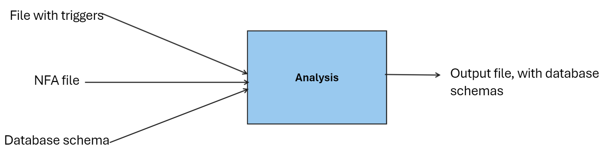

### Model Overview

Our model operates by taking three inputs: a file containing triggers, another file containing an NFA and a third file comprising the database schema.

1. **Input Files**:
    
    - **Triggers File**: Contains the triggers that initiate actions within the database.
    - **NFA File**: Specifies the Non-deterministic Finite Automaton, which serves as an abstraction of user actions within the database.
    - **Database Schema File**: Defines the structure and organization of the database.
2. **Transition Process**:

	- Upon receiving the NFA, the model traverses its transitions one by one.
	- Each transition within the NFA corresponds to a specific action that the user can perform within the database. However, it's important to note that some transitions may not directly modify the database state but instead lead to new states, allowing for subsequent transitions without immediate database changes.
	- When executing a transition that modifies the database, the model updates the database state accordingly.
	- The model records these state changes as it progresses through the transitions, maintaining a comprehensive record of the database evolution.
	- This iterative process continues until all required transitions have been successfully executed, ensuring that the model accurately reflects the intended database behavior.
1. **Output**:
    
    - The final output of the model is the sequence of operations made in the model and the for every state, a list of abstract databases.
4. **Abstraction and Efficiency**:
    
    - The NFA serves as an abstraction layer over the various actions users can perform within the database.
    - This abstraction enables a more concise representation of user interactions, leading to fewer outputs.
    - Additionally, when one abstraction encompasses another, the model can disregard the latter, thereby streamlining the output process.

By employing this model, we can efficiently simulate and analyze user interactions with the database while minimizing output complexity through strategic abstraction.

